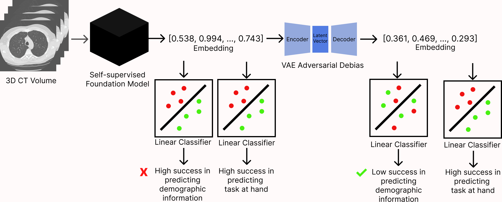

# VAE-Adversarial-Debiasing

This is the GitHub repo for our paper submission to MIDL 2025: Towards Fair Medical AI: Adversarial Debiasing of 3D CT Foundation Embeddings.

This repo has a jupyter notebook file that includes everything needed to reproduce our results, except the NLST dataset, which can be accessed through Google's CT Foundation Tool https://research.google/blog/taking-medical-imaging-embeddings-3d/

Self-supervised learning has revolutionized medical imaging by enabling efficient and generalizable feature extraction from large-scale unlabeled datasets. Recently, self-supervised foundation models have been extended to three-dimensional (3D) computed tomography (CT) data, generating compact, information-rich embeddings with 1408 features that achieve state-of-the-art performance on downstream tasks such as intracranial hemorrhage detection and lung cancer risk forecasting. However, these embeddings have been shown to encode demographic information, such as age, sex, and race, which poses a significant risk to the fairness of clinical applications.

In this work, we propose a Variation Autoencoder (VAE) based adversarial debiasing framework to transform these embeddings into a new latent space where demographic information is no longer encoded, while maintaining the performance of critical downstream tasks. We validated our approach on the NLST lung cancer screening dataset, demonstrating that the debiased embeddings effectively eliminate multiple encoded demographic information and improve fairness without compromising predictive accuracy for lung cancer risk at 1-year and 2-year intervals. Additionally, our approach ensures the embeddings are robust against adversarial bias attacks. These results highlight the potential of adversarial debiasing techniques to ensure fairness and equity in clinical applications of self-supervised 3D CT embeddings, paving the way for their broader adoption in unbiased medical decision-making.

